# LeadsGrid

<div align="center">


# LeadsGrid

### Discover. Qualify. Engage. Close.

AI-powered lead discovery, CRM, and autonomous outreach platform built for modern sales teams.

[Live Platform](https://leadsgrid.vercel.app/) •
[Features](#features) •
[Architecture](#architecture) •
[Getting Started](#getting-started) •
[Roadmap](#roadmap)

<br/>


</div>

---

## What is LeadsGrid?

<div align="center">
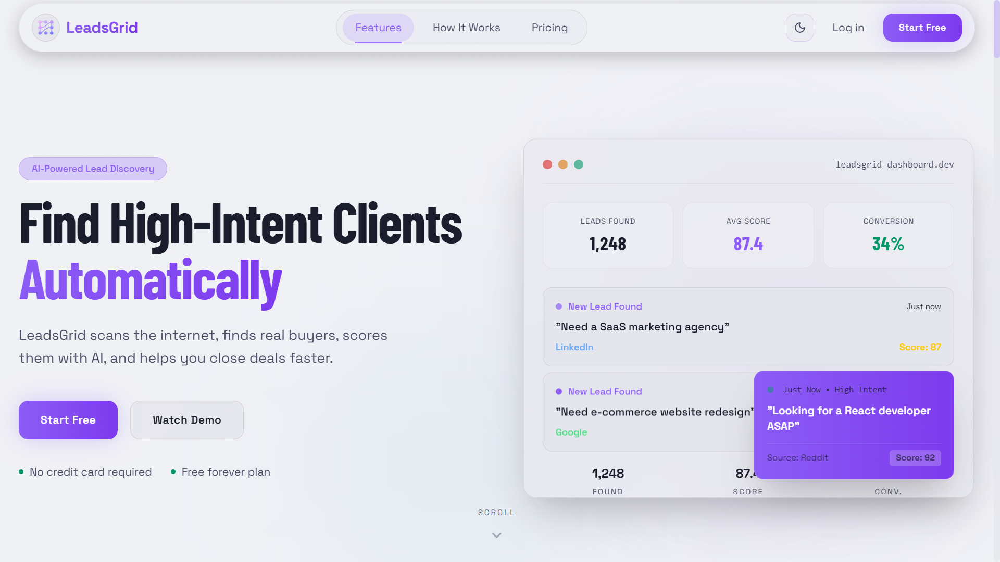
</div>

LeadsGrid is an AI-powered revenue platform that helps businesses discover high-intent prospects, qualify opportunities, manage pipelines, and execute personalized outreach workflows from a single workspace.

Traditional sales stacks require multiple disconnected tools:

* Lead databases
* CRMs
* Outreach platforms
* AI assistants
* Analytics dashboards

LeadsGrid combines them into one intelligent operating system.

---

## Why LeadsGrid?

<div align="center">
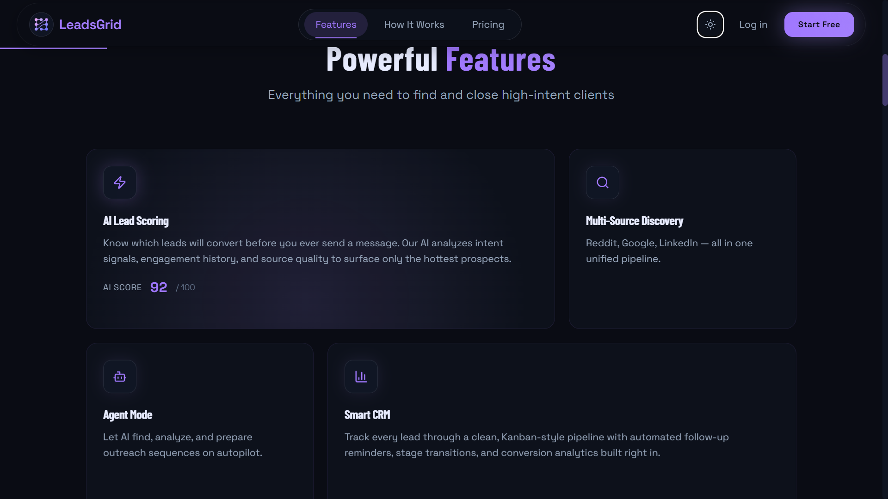
</div>

Most tools stop at information.

LeadsGrid focuses on execution.

### Traditional Workflow

```text
Find Leads
    ↓
Export CSV
    ↓
Import to CRM
    ↓
Research Manually
    ↓
Write Emails
    ↓
Track Responses
```

### LeadsGrid Workflow

```text
Discover Leads
      ↓
AI Qualification
      ↓
Agent Planning
      ↓
Automated Outreach
      ↓
Pipeline Tracking
      ↓
Continuous Optimization
```

The result:

* Faster prospecting
* Better lead quality
* Higher personalization
* Reduced manual work
* More conversations booked

<div align="center">
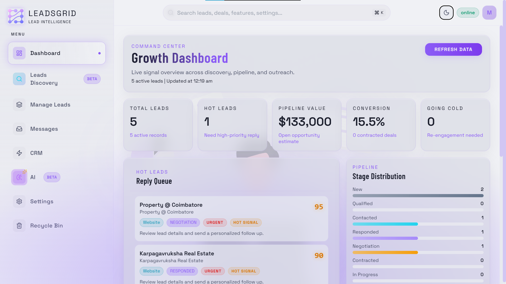
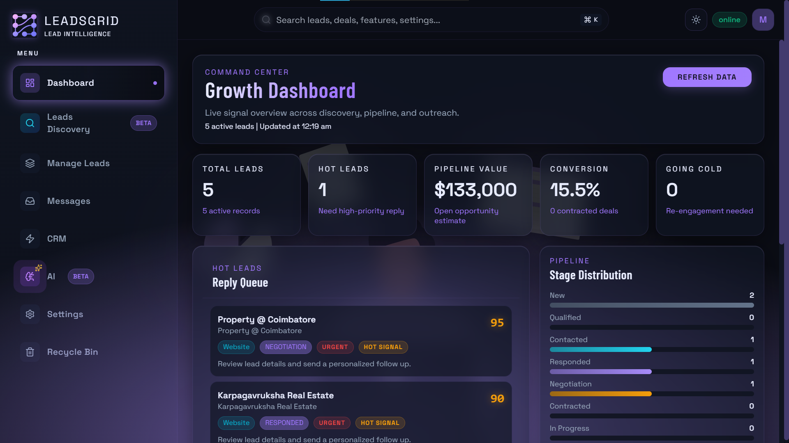
</div>

---

## Features

### Lead Discovery Engine

<div align="center">
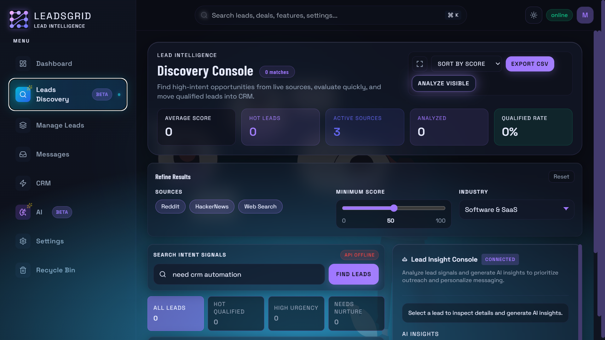
</div>

Identify potential customers from multiple data sources.

Capabilities:

* Multi-source lead discovery
* Company intelligence gathering
* Lead enrichment
* Contact aggregation
* Search-driven prospecting
* Lead qualification workflows

---

### Intelligent CRM

<div align="center">
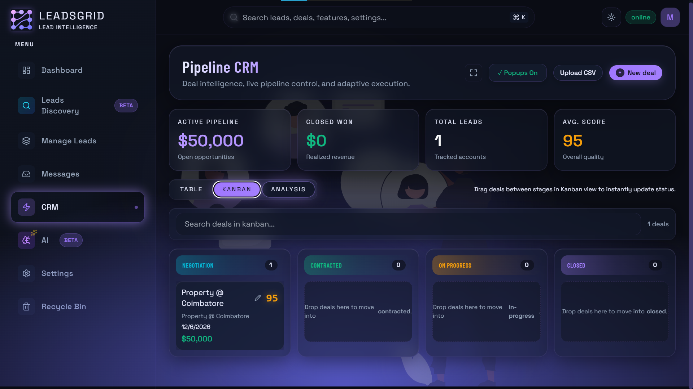
</div>

Manage opportunities without CRM complexity.

Features:

* Lead management
* Pipeline tracking
* Project organization
* Activity logging
* Prospect notes
* Lead lifecycle monitoring
* Deduplication system

Built using scalable Firestore-friendly patterns.

---

### Agent Mode

<div align="center">
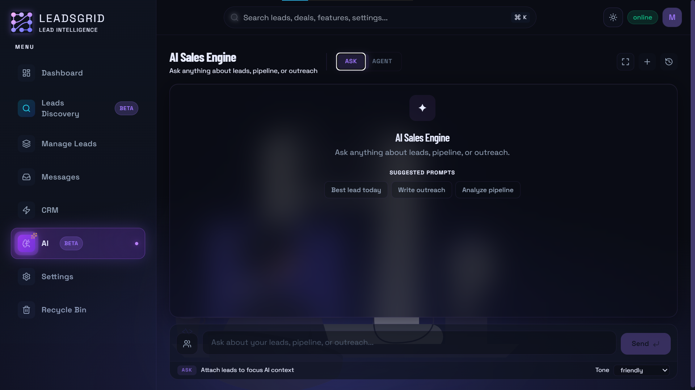
</div>

The heart of LeadsGrid.

Instead of simply suggesting actions, AI agents can plan and execute workflows.

#### Plan

Generate structured prospecting strategies:

* Target accounts
* Qualification criteria
* Outreach plans
* Follow-up schedules

#### Execute

Run autonomous workflows:

* Lead research
* Qualification
* Data processing
* Outreach preparation
* Pipeline actions

#### Track

Monitor:

* Agent runs
* Execution snapshots
* Workflow history
* Results and outputs

---

### Email Orchestration

<div align="center">
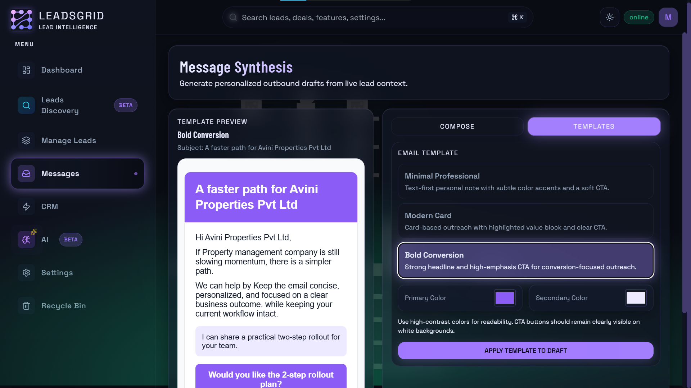
</div>

Launch personalized outreach campaigns directly from LeadsGrid.

Features:

* SMTP integration
* HTML email support
* Plain text support
* Template metadata
* Dynamic personalization
* Reply-to management

Identity formatting:

```text
From:
"John Smith via LeadsGrid" <smtp@company.com>

Reply-To:
john@company.com
```

---

### AI-Powered Qualification

<div align="center">
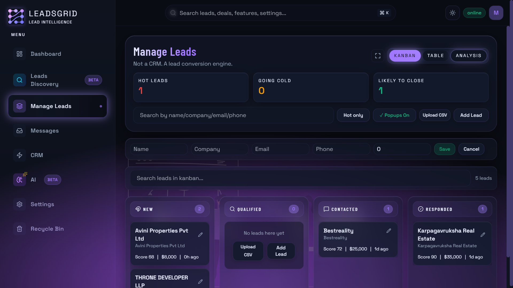
</div>

Automatically evaluate leads using customizable qualification logic.

Analyze:

* Company fit
* Industry relevance
* Growth indicators
* Intent signals
* Outreach readiness

Focus your team on opportunities that matter.

---

<div align="center">
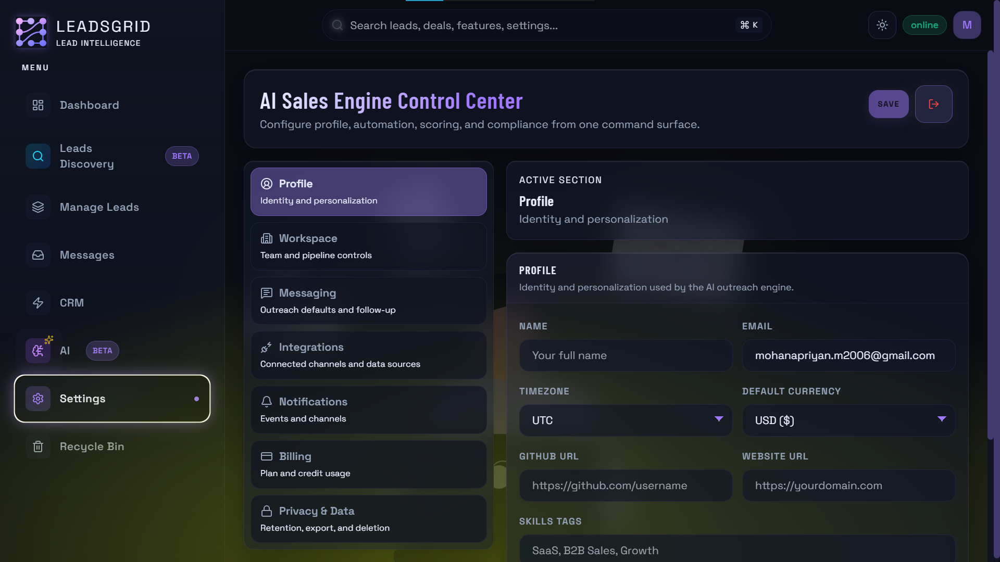
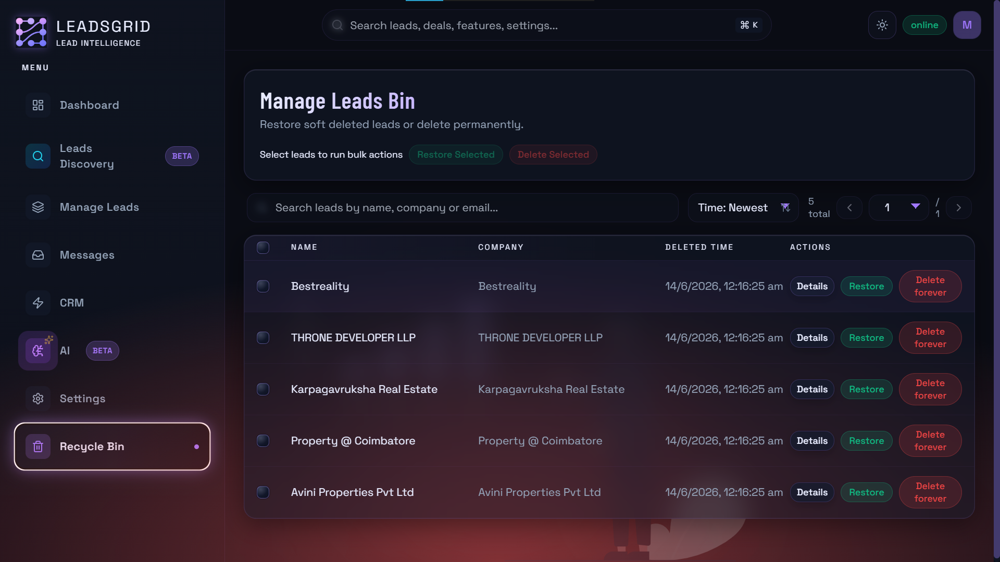
</div>

## Product Architecture

```text
┌─────────────────────────┐
│      Lead Sources       │
└────────────┬────────────┘
             │
             ▼
┌─────────────────────────┐
│   Discovery Engine      │
└────────────┬────────────┘
             │
             ▼
┌─────────────────────────┐
│      CRM Layer          │
└────────────┬────────────┘
             │
             ▼
┌─────────────────────────┐
│      AI Agents          │
│ Plan → Execute → Track  │
└────────────┬────────────┘
             │
             ▼
┌─────────────────────────┐
│ Email Orchestration     │
└────────────┬────────────┘
             │
             ▼
┌─────────────────────────┐
│ Revenue Outcomes        │
└─────────────────────────┘
```

---

## Tech Stack

### Frontend

```txt
React
TypeScript
Vite
Tailwind CSS
React Router
TanStack Query
Zustand
Axios
Framer Motion
```

### Backend

```txt
FastAPI
Python
Agent Execution Engine
Workflow Planning System
Email Orchestration Layer
Firebase Integration
```

### Infrastructure

```txt
Firestore
SMTP Providers
AI Providers
REST APIs
Cloud Deployments
```

---

## Repository Structure

```text
leadsgrid/

├── frontend/
│   ├── src/
│   ├── components/
│   ├── pages/
│   ├── services/
│   ├── store/
│   └── hooks/
│
├── backend/
│   ├── app/
│   ├── agents/
│   ├── services/
│   ├── discovery/
│   ├── email/
│   └── integrations/
│
└── docs/
```

---

## Getting Started

### Frontend Setup

```bash
cd frontend

npm install

npm run dev
```

Create:

```env
VITE_API_BASE_URL=http://localhost:8000/api
```

---

### Backend Setup

```bash
cd backend

python -m venv .venv
```

Windows:

```bash
.venv\Scripts\activate
```

macOS/Linux:

```bash
source .venv/bin/activate
```

Install dependencies:

```bash
pip install -r requirements.txt
```

Configure environment:

```bash
cp .env.example .env
```

Run server:

```bash
uvicorn app.main:app --reload --port 8000
```

Backend:

```text
http://localhost:8000
```

---

## API Overview

### Health

```http
GET /api/health
GET /api/health/ready
```

### Agent System

```http
POST /api/agent/plan
POST /api/agent/execute
POST /api/agent/run
```

### Discovery

```http
GET /api/agent/discover?query=
```

### Email

```http
POST /api/email/send
```

---

## SMTP Configuration

Recommended for development:

### Gmail SMTP

```env
SMTP_HOST=smtp.gmail.com
SMTP_PORT=587
SMTP_USE_STARTTLS=true
SMTP_EMAIL=yourgmail@gmail.com
SMTP_PASSWORD=your_app_password
SMTP_RATE_LIMIT_PER_MIN=20
SMTP_TIMEOUT_SECONDS=15
```

For production workloads, use:

* Amazon SES
* SendGrid
* Mailgun
* Postmark
* Resend

with SPF, DKIM, and DMARC configured.

---

## Roadmap

### Current

* Lead Discovery
* CRM Workspace
* Agent Planning
* Agent Execution
* SMTP Outreach
* Firestore Support

### Upcoming

* Team Workspaces
* Role-Based Access Control
* Smart Sequences
* Inbox Analytics
* AI Follow-Up Generation
* Intent Scoring
* LinkedIn Enrichment
* Chrome Extension
* Multi-Agent Collaboration
* Workflow Builder

---

## Vision

Sales teams shouldn't waste hours searching, researching, copying, importing, and organizing data.

LeadsGrid is building an autonomous revenue operating system where AI agents help discover opportunities, qualify prospects, execute workflows, and accelerate pipeline growth.

---

## Contributing

We welcome contributions from developers, growth engineers, and sales-tech enthusiasts.

When contributing new lead sources:

* Include parsing tests
* Define deduplication strategy
* Normalize output schema
* Document rate limits
* Provide source validation

---

## License

Specify your preferred license:

* MIT
* Apache 2.0
* Proprietary
* Commercial

---

<div align="center">

### Built for modern sales teams.

⭐ Star the repository if you find LeadsGrid useful.

### LeadsGrid — The AI-Powered Revenue Operating System.

https://leadsgrid.vercel.app/

</div>
